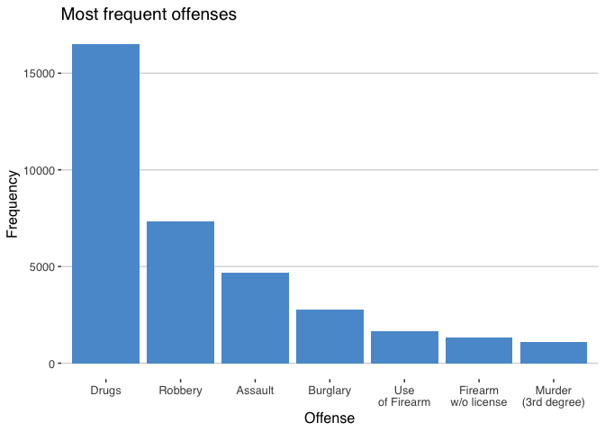
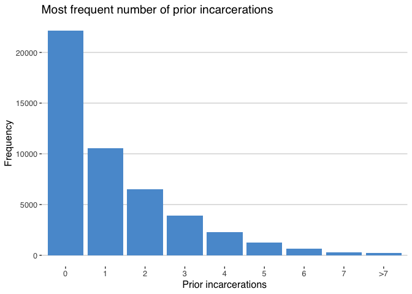
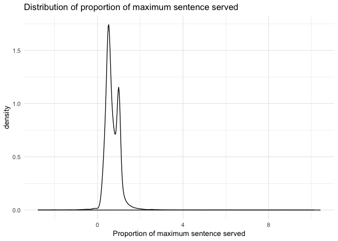
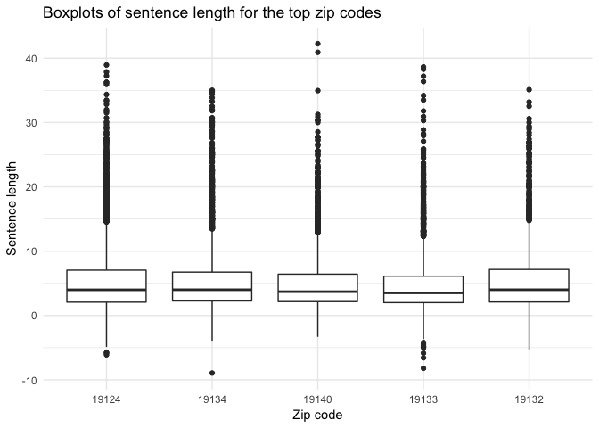

DOC data overview
================
Eric Oh
8/13/2019

This document summarizes key variables from the Philadelphia Department of Corrections (DOC) data. The dataset represents incarcerated person releases from 2007-2016 throughout the Philadelphia area.

Zip codes
=========

Let's take a look at from which zip codes the most releases occured.

``` r
zip_code_freq <- data.frame(table(doc_dat$legal_zip_code))
colnames(zip_code_freq) <- c("Zip_code", "Frequency")
zip_code_freq <- zip_code_freq[order(zip_code_freq$Frequency,
                                     decreasing = TRUE),]
zip_code_freq$Percent <- (zip_code_freq$Frequency / sum(zip_code_freq$Frequency)) * 100

#kable(zip_code_freq[1:10,], row.names = FALSE) %>% kable_styling(position = "center")
```

Zip code plot
-------------

``` r
# plot all zip codes with more than 1000 releases
# and group all others in OTHER category

#zip_code_plot_dat <- zip_code_freq[zip_code_freq$Frequency >= 1000,]

#zip_code_others <- data.frame(Zip_code = "Other",
#                              Frequency = sum(zip_code_freq$Frequency[zip_code_freq$Frequency < 1000]),
#                              Percent = 0)

#zip_code_plot_dat <- data.frame(rbind(zip_code_plot_dat, zip_code_others))
```

Comparing the number of releases across zip codes visually.

``` r
zip_code_plot_dat <- zip_code_freq[1:10,]
zip_code_plot_dat$Zip_code <- factor(zip_code_plot_dat$Zip_code, 
                                     levels = zip_code_plot_dat$Zip_code[order(-zip_code_plot_dat$Percent)])

ggplot(zip_code_plot_dat, aes(x = Zip_code, y = Frequency)) + 
  geom_bar(stat = "identity", fill = "#599ad3") +
  xlab("Zip code") + ylab("Frequency") + 
  ggtitle("Most frequent zip codes with offenses") + 
  theme_hc()
```


Zip code over time
------------------

The three zip codes that had the most number of releases is 19124, 19134, and 19140. Let's see if the number of releases has varied much over time.

``` r
# plot trend of releases from top three zip codes
top_three_zip <- c(19124, 19134, 19140)
zip_code_trend <- doc_dat[,c("ReleaseYear", "legal_zip_code")]
zip_code_trend <- zip_code_trend[zip_code_trend$legal_zip_code %in% top_three_zip,]

zip_code_trend_count  <- zip_code_trend %>%
  group_by(ReleaseYear, legal_zip_code) %>%
  count(ReleaseYear) %>%
  as.data.frame()

ggplot(zip_code_trend_count,
       aes(x = as.factor(ReleaseYear), y = n, 
           colour = as.factor(legal_zip_code), 
           group = as.factor(legal_zip_code))) +
  geom_line() + 
  geom_point(size = 2.5) + 
  scale_colour_manual(values = c("#00AFBB", "#E7B800", "#FC4E07")) +
  labs(x = "Release year", y = "Number of releases", colour = "Zip codes") + 
  theme_minimal()
```


Race
====

Let's take a look at the distribution of different races amongst all offenses.

``` r
race_freq <- data.frame(table(doc_dat$race))
colnames(race_freq) <- c("Race", "Frequency")
race_freq <- race_freq[order(race_freq$Frequency,
                             decreasing = TRUE),]
race_freq$Percent <- (race_freq$Frequency / sum(race_freq$Frequency)) * 100

#kable(race_freq, row.names = FALSE) %>% kable_styling(position = "center")

ggplot(race_freq,
       aes(x = as.factor(Race), y = Frequency)) + 
  geom_bar(stat = "identity") + 
  geom_text(aes(label = Frequency), 
            position = position_dodge(width = 0.9), 
            vjust = -0.5) + 
  labs(x = "Race", y = "Frequency") + 
  theme_minimal()
```


Sex
===

Let's take a look at the distribution of sex amongst all offenses.

``` r
sex_freq <- data.frame(table(doc_dat$sex))
colnames(sex_freq) <- c("Sex", "Frequency")
sex_freq <- sex_freq[order(sex_freq$Frequency,
                             decreasing = TRUE),]
sex_freq$Percent <- (sex_freq$Frequency / sum(sex_freq$Frequency)) * 100

#kable(sex_freq, row.names = FALSE) %>% kable_styling(position = "center")

ggplot(sex_freq,
       aes(x = as.factor(Sex), y = Frequency)) + 
  geom_bar(stat = "identity") + 
  geom_text(aes(label = Frequency), 
            position = position_dodge(width = 0.9), 
            vjust = -0.5) + 
  labs(x = "Sex", y = "Frequency") + 
  theme_minimal()
```


Offenses
========

More unique offense codes than offenses..what is going on?

What are the most frequent offenses?

``` r
offense_freq <- data.frame(table(doc_dat$offense))
colnames(offense_freq) <- c("Offense", "Frequency")
offense_freq <- offense_freq[order(offense_freq$Frequency,
                             decreasing = TRUE),]
offense_freq$Percent <- (offense_freq$Frequency / sum(offense_freq$Frequency)) * 100

#kable(offense_freq[1:10,], row.names = FALSE) %>% kable_styling(position = "center")
```

There seem to be different versions of some offenses (ie. robbery vs. robbery (general)). Not sure what this is. But let's combine them and then recalculate.

``` r
offense_agg <- doc_dat %>%
  mutate(offense = trimws(offense),
         offense = str_replace(offense, " \\(GENERAL\\)", ""))

offense_agg_freq <- data.frame(table(offense_agg$offense))
colnames(offense_agg_freq) <- c("Offense", "Frequency")
offense_agg_freq <- offense_agg_freq[order(offense_agg_freq$Frequency,
                             decreasing = TRUE),]
offense_agg_freq$Percent <- (offense_agg_freq$Frequency / sum(offense_agg_freq$Frequency)) * 100

#kable(offense_agg_freq[1:10,], row.names = FALSE) %>% kable_styling(position = "center")
```

Offenses plot
-------------

Now let's look at which offenses were most common amongst released persons.

``` r
offense_plot_dat <- offense_freq[offense_freq$Frequency >= 1000,]

offense_plot_dat_agg <- do.call(rbind, lapply(c('ROBBERY', 'ASSAULT', 'BURGLARY'),
                                function(x) {
         temp_df <- offense_plot_dat[grep(x, offense_plot_dat$Offense, ignore.case=TRUE),]
         data.frame(Offense = x, 
                    Frequency = sum(temp_df$Frequency), 
                    Percent = sum(temp_df$Percent))}))

offense_plot_dat_agg <- rbind(offense_plot_dat_agg, 
                              offense_plot_dat[c(1, 6, 9, 10),])

offense_plot_dat_agg$Offense <- factor(offense_plot_dat_agg$Offense,
                                       levels = offense_plot_dat_agg$Offense[order(-offense_plot_dat_agg$Percent)])

ggplot(offense_plot_dat_agg, aes(x = Offense, y = Frequency)) + 
  geom_bar(stat = "identity", fill = "#599ad3") +
  scale_x_discrete(labels = c("Drugs", "Robbery", "Assault",
                              "Burglary", "Use\nof Firearm", 
                              "Firearm\nw/o license", "Murder\n(3rd degree)")) + 
  xlab("Offense") + ylab("Frequency") + 
  ggtitle("Most frequent offenses") + 
  theme_hc()
```



Offenses by zip code
--------------------

The most common offenses and their frequencies in the five zip codes with most releases.

``` r
most_common_zip <- c(19124, 19134, 19140,
                     19133, 19132)

# remove white space at the end of the factor 
# level label and remove (GENERAL) 
# to aggregate with non-general ones
offense_by_zip_dat <- doc_dat[doc_dat$legal_zip_code %in% most_common_zip, 
                              c("legal_zip_code", "offense")] %>%
  mutate(offense = trimws(offense),
         offense = str_replace(offense, " \\(GENERAL\\)", ""))

offense_by_zip_dat <- offense_by_zip_dat %>%
  group_by(legal_zip_code, offense) %>%
  summarise(count = n()) %>%
  filter(row_number(desc(count)) < 4) %>%
  as.data.frame()

ggplot(offense_by_zip_dat,
       aes(x = as.factor(legal_zip_code), y = count, 
           fill = offense)) + 
  geom_bar(position = "dodge", stat = "identity") + 
  labs(x = "Zip code", y = "Count of offenses",
       fill = "Offense") + 
  scale_fill_manual(values = c("#00AFBB", "#E7B800", "#FC4E07"),
                    labels = c("Aggravated assault",
                                 "Drug sale",
                                 "Robbery")) + 
  ggtitle("Count of most frequent offenses in the top 5 zip codes") + 
  theme_minimal()
```


Classify offenses
-----------------

We can also classify the offenses into violent or non-violent. We consider violent crimes to be robbery, assault, murder, rape, manslaughter, homicide, kidnapping, or any other crimes resulting in bodily injury or death.

``` r
violent_keywords <- c("ROBBERY", "ASSAULT", "MURDER",
                      "RAPE", "SEXUAL", "MANSLAUGHTER",
                      "BODILY", "KIDNAPPING", "HOMICIDE",
                      "DEATH")
not_violent_keyword <- c("VEHICLES")

doc_dat$violent_crime <- as.numeric(str_detect(doc_dat$offense, 
                                               paste(violent_keywords, collapse="|")))

violent_crime_trend <- doc_dat[,c("ReleaseYear", "violent_crime")]

violent_crime_trend_count  <- violent_crime_trend %>%
  group_by(ReleaseYear, violent_crime) %>%
  #filter(violent_crime == 1) %>%
  count(ReleaseYear) %>%
  as.data.frame()

ggplot(violent_crime_trend_count,
       aes(x = as.factor(ReleaseYear), y = n, 
           colour = as.factor(violent_crime), 
           group = as.factor(violent_crime))) +
  geom_line() + 
  geom_point(size = 2.5) + 
  scale_colour_manual(values = c("#00AFBB", "#E7B800"),
                      labels = c("Non-violent", "Violent")) +
  labs(x = "Release year", y = "Number of releases", 
       colour = "Type of crime") + 
  theme_minimal()
```


Priors
======

Now let's take a look at the distribution of prior incarcerations for persons released in the data.

``` r
prior_freq <- data.frame(table(doc_dat$Prior.Incs))
colnames(prior_freq) <- c("Prior_incarcerations", "Frequency")
prior_freq <- prior_freq[order(prior_freq$Frequency,
                             decreasing = TRUE),]
prior_freq$Percent <- (prior_freq$Frequency / sum(prior_freq$Frequency)) * 100

#kable(prior_freq, row.names = FALSE) %>% kable_styling(position = "center")
```

Priors plot
-----------

We can view the distribution of priors visually as well.

``` r
prior_plot_dat <- prior_freq[prior_freq$Frequency >= 297,]

prior_others <- data.frame(Prior_incarcerations = ">7",
                           Frequency = sum(prior_freq$Frequency[prior_freq$Frequency < 297]),
                           Percent = 0)

prior_plot_dat <- data.frame(rbind(prior_plot_dat, prior_others))
prior_plot_dat$Prior_incarcerations <- factor(prior_plot_dat$Prior_incarcerations, 
                                     levels = prior_plot_dat$Prior_incarcerations[order(-prior_plot_dat$Percent)])

ggplot(prior_plot_dat, aes(x = Prior_incarcerations, y = Frequency)) + 
  geom_bar(stat = "identity", fill = "#599ad3") +
  xlab("Prior incarcerations") + ylab("Frequency") + 
  ggtitle("Most frequent number of prior incarcerations") + 
  theme_hc()
```



Sentencing lengths
==================

Let's investigate the lengths of sentenences for all releases and what proportion of the maximum sentence they served. The distributions of the sentence lengths and proportion of maximum sentences served are given below.

``` r
doc_dat$release_date_format <- parse_date_time(doc_dat$ReleaseDate,
                                               orders = c('d-m-y'))

doc_dat$min_sent_date_format <- parse_date_time(doc_dat$MinDate,
                                                orders = c('d-m-y'))

doc_dat$min_sent_year <- year(doc_dat$min_sent_date_format)

doc_dat$max_sent_date_format <- parse_date_time(doc_dat$MaxDt,
                                                orders = c('d-m-y'))

doc_dat$sentence_length <- time_length(interval(doc_dat$min_sent_date_format,
                                                doc_dat$release_date_format),
                                       "year") + 
  (doc_dat$MinSentYrs + doc_dat$MinSentMos/12)

doc_dat$prop_max_sent_served <- doc_dat$sentence_length / (doc_dat$MaxSentYrs + doc_dat$MaxSentMos/12)

sentence_summary_dat <- data.frame(do.call(rbind, 
                                lapply(doc_dat[, c("min_sent_year",
                                                   "sentence_length",
                                                   "prop_max_sent_served")],
                                       summary)))

#kable(sentence_summary_dat, row.names = FALSE) %>% kable_styling(position = "center")
```

``` r
ggplot(doc_dat,
       aes(x = sentence_length)) +
  geom_density(adjust = 2) + 
  labs(x = "Sentence lengths") + 
  ggtitle("Distribution of sentence lengths") +
  theme_minimal()
```


``` r
ggplot(doc_dat,
       aes(x = prop_max_sent_served)) +
  geom_density(adjust = 2) + 
  labs(x = "Proportion of maximum sentence served") + 
  ggtitle("Distribution of proportion of maximum sentence served") +
  theme_minimal()
```



Plot sentence lengths in top 5 zip codes
----------------------------------------

Distributions of sentence lengths in the top 5 zip codes.

``` r
sentence_length_dat <- doc_dat[doc_dat$legal_zip_code %in% most_common_zip,]
sentence_length_by_zip <- sentence_length_dat[,c("legal_zip_code", "sentence_length",
                                                 "prop_max_sent_served")]

sentence_length_by_zip$legal_zip_code <- factor(sentence_length_by_zip$legal_zip_code,
                                                levels = most_common_zip)

ggplot(sentence_length_by_zip,
       aes(x = as.factor(legal_zip_code), y = sentence_length)) +
  geom_boxplot() + 
  labs(x = "Zip code", y = "Sentence length") + 
  ggtitle("Boxplots of sentence length for the top zip codes") + 
  theme_minimal()
```



Distributions of proportion of maximum sentence served in the top 5 zip codes.

``` r
ggplot(sentence_length_by_zip,
       aes(x = as.factor(legal_zip_code), y = prop_max_sent_served)) +
  geom_boxplot() + 
  labs(x = "Zip code", y = "Proportion of maximum sentence served") + 
  ggtitle("Boxplots of proportion of max sentence for the top zip codes") + 
  theme_minimal()
```


