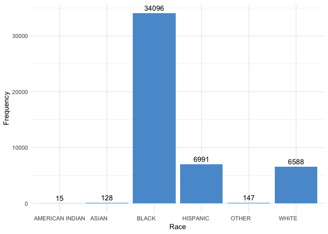
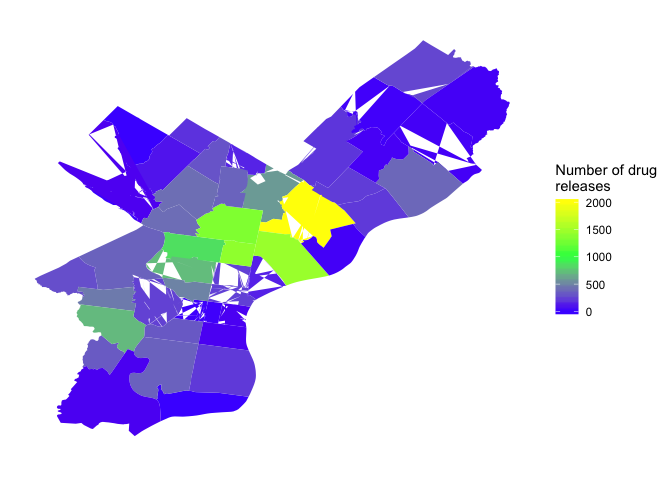
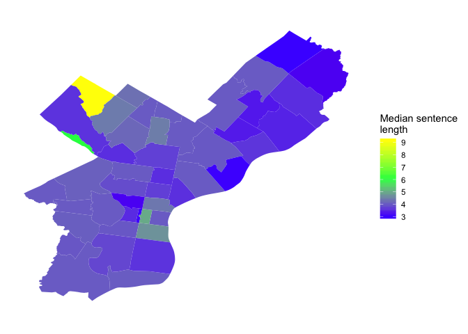

DOC data overview
================
Eric Oh
8/13/2019

This document summarizes key variables from the Philadelphia Department of Corrections (DOC) data. The dataset represents incarcerated person releases from 2007-2016 throughout the Philadelphia area.

Zip codes
=========

Let's take a look at from which zip codes the most releases occured.

The three zip codes that had the most number of releases is 19124, 19134, and 19140. Let's see if the number of releases has varied much over time.

The number of releases in 19124 seems to have decreased through the years, though not consistently. In 19134, the number of releases has somewhat consistently increased. In 19140, the number of releases rose but went down again. Now we can compare the number of releases across all Philadelphia zip codes.

    ## OGR data source with driver: ESRI Shapefile 
    ## Source: "/Users/ericoh/Dropbox/doc_project/Zipcodes_Poly", layer: "Zipcodes_Poly"
    ## with 48 features
    ## It has 5 fields
    ## Integer64 fields read as strings:  OBJECTID COD

Race
====

Let's take a look at the distribution of different races amongst all offenses.

Sex
===

Let's take a look at the distribution of sex among all offenses.

Offenses
========

Now let's look at the distribution of offenses among releases persons. Note: there are more unique offense codes than offenses. Not too sure why, need to investigate further.

Additionally, there seem to be different versions of some offenses (ie. robbery vs. robbery (general)). Not sure what this is. But let's combine them for now.

Now let's look at which offenses were most common amongst released persons.

From before, we know that 19124, 19132, 19133, 19134, and 19140 had the highest number of releases. What are the top three most common offenses in these five zip codes?

In all of the five zip codes, we see that the three most common offenses were drug sales, robbery, and assault. Let's see the distribution of these offenses across all Philadelphia zip codes.

We can also classify the offenses into violent or non-violent. We consider violent crimes to be robbery, assault, murder, rape, manslaughter, homicide, kidnapping, or any other crimes resulting in bodily injury or death. We plot the number of violent and non-violent offense releases over time.

Priors
======

Now let's take a look at the distribution of prior incarcerations for persons released in the data.

Sentencing lengths
==================

Let's investigate the lengths of sentenences for all releases and what proportion of the maximum sentence they served. The distributions of the sentence lengths and proportion of maximum sentences served are given below.

Below are boxplots of sentence lengths in the top five zip codes to see if there are any differences.

Below are boxplots of proportion of maximum sentence served in the top five zip codes to see if there are any differences.

Now let's compare the sentence lengths and proportion of maximum sentence served across all Philadelphia zip codes.

